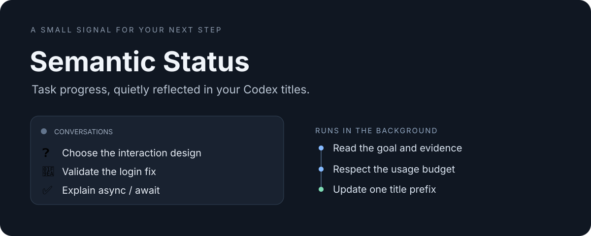

<p align="center"></p>

# Codex Semantic Status

[](https://github.com/shiiiiiiji/codex-semantic-status/actions/workflows/ci.yml)


**Know where the task stands.** Add a semantic status emoji to Codex conversation titles in the background, with a persistent usage budget.

[简体中文](README.zh-CN.md) · [Architecture](docs/design.md) · [Configuration](docs/configuration.md)

Code written but untested → 🧪. A decision still needs your input → ❓. Tests passed, but the requested merge is awaiting review → ⏳. A response finishing alone does not mean the task is complete.

## What it does

- Infers status from the task goal, recent conversation evidence and a cached summary.
- Uses a silent asynchronous Stop Hook and one detached worker; the main conversation does not wait for classification.
- Reuses Codex login by default; optionally selects a custom provider/model through a setup wizard or CLI.
- Debounces events, skips unchanged content, and stores call limits and Token budgets across worker restarts.
- Revalidates content and title before writing. Manual renames pause automatic updates for that conversation.
- Keeps low-confidence decisions and incomplete requirements from becoming misleading completion markers.

## Install

Requires **Python 3.11+**, an authenticated **Codex installation**, and **macOS or Linux**. There are no third-party Python dependencies; Node and npm are optional convenience tools, not runtime requirements.

```sh
git clone https://github.com/shiiiiiiji/codex-semantic-status.git
cd codex-semantic-status
python3 scripts/semantic_status.py doctor
python3 scripts/semantic_status.py install
```

The installer registers this checkout as a local plugin source and uses Codex's official plugin installation interface. It does not publish to a registry or trust hooks automatically.

In the Codex CLI, run `/hooks`, review the **Stop** Hook from `codex-semantic-status@semantic-status-local`, and trust that exact definition. New or reopened conversations load the enabled plugin. Keep the checkout available as the local source; Codex executes an installed cache copy.

When moving an existing checkout, use `install --replace-source` to explicitly replace this plugin's old source path. Changing source does not reset your budgets. Use a newer plugin version when distributing changed runtime files; review changed Hook definitions again.

The active manifest is `.codex-plugin/plugin.json`. We use the Codex compatibility format because it was verified with local lifecycle Hook discovery. This package is intended for Codex and does not promise a Claude Code runtime integration.

## Status vocabulary

| Emoji | State | Meaning |
| --- | --- | --- |
| 📥 | `pending` | Recorded, not started |
| ▶️ | `in_progress` | Work remains and can proceed |
| ❓ | `decision` | Needs your decision or confirmation |
| ⏳ | `waiting` | Waiting for an external reply or result |
| ⛔ | `blocked` | An obstacle prevents progress |
| 🧪 | `verify` | Output exists; tests, review or acceptance remain |
| ✅ | `completed` | The requested outcome has supporting completion evidence |
| ⏸️ | `paused` | Explicitly deferred |

`unknown` does not change the title. Existing custom prefixes such as 🚩 are preserved. The model cannot invent a title or emoji: a validated state selects one fixed local prefix.

## Cost controls

For custom models, run `python3 scripts/semantic_status.py provider setup` in a terminal. The wizard supports OpenAI-compatible Chat Completions and Responses, API base URL/model settings, hidden input into a private key file and environment-variable references. Setup makes no model call. Commands `provider add/use/list/reset/remove` support scripted management. See [provider configuration](docs/providers.md).

The direct API backend sends only the bounded classification prompt and conversation selection, avoiding Codex framework input overhead. Existing Codex providers are also supported. Provider settings apply to the background classifier.

| Control | Default |
| --- | --- |
| Event debounce | 60 seconds |
| Per-conversation inference cooldown | 300 seconds |
| Daily attempts, global / per conversation | 20 / 6 |
| Daily Token admission budget | 50,000 |
| Reserved Tokens per attempt, Codex / direct API | 20,000 / 8,000 |
| Direct API output cap | 512 Tokens |
| Conversation payload limit | 6,000 characters |
| Classification timeout | 45 seconds |
| Worker concurrency | 1 |

With the Codex backend, framework instructions and global `AGENTS.md` count toward Token usage. In three synthetic examples with one tested desktop runtime, an attempt consumed about **11.6k total Tokens**. This is an illustrative measurement, not a universal cost or accuracy benchmark. At that usage, the default budget admits about 2–3 daily classifications before the Token gate becomes binding.

The budget limits admission to new requests. One in-flight request can exceed its reservation or daily budget; it is **not a hard monetary cap**. Known usage is recorded even on failure, and unknown usage retains its reservation. Your Codex account or configured provider bears the inference cost.

Auto selection prefers an advertised `luna`, then `nano`, then `mini` family; these names are a selection convention, not a pricing guarantee. Check the provider's actual pricing or set `model` explicitly. It never silently falls back to a large model.

```sh
python3 scripts/semantic_status.py status
python3 scripts/semantic_status.py configure --set 'max_tokens_per_day=50000'
python3 scripts/semantic_status.py configure --set 'model="gpt-6-luna"'
python3 scripts/semantic_status.py configure --set 'enabled=false'
```

[All settings and troubleshooting](docs/configuration.md).

## Manage a conversation

Replace `THREAD_ID` with the conversation's Codex thread ID.

```sh
python3 scripts/semantic_status.py pause THREAD_ID
python3 scripts/semantic_status.py resume THREAD_ID
python3 scripts/semantic_status.py enqueue THREAD_ID
python3 scripts/semantic_status.py preview THREAD_ID
python3 scripts/semantic_status.py logs --limit 20
```

`preview` uses the normal budget and returns a proposed title without writing it. `enqueue` schedules a background attempt under the normal debounce and budget. `resume` releases a manual-rename pause; changed content on a subsequent event can classify again. The management Skill can also be invoked as `semantic-status` in Codex.

## Privacy and limits

The plugin sends a bounded selection of conversation text to the selected Codex or direct API provider. Local storage contains managed titles, short semantic summaries, thread IDs and usage records. Diagnostic events contain result codes and error types rather than raw exception text. See [security and privacy](SECURITY.md).

Semantic markers reflect available conversation evidence; they do not independently verify external tests, merges, deployments or real-world tasks. The context includes the original goal, recent three turns and prior summary, so distant corrections can still be missed. Truncated user requirements prevent a completion marker.

The title API has no atomic compare-and-set operation; a narrow manual-rename race remains possible. Desktop title refresh may require reopening the conversation. App-server APIs are experimental and may vary by Codex version. Windows is not supported because the worker uses POSIX file locks and process groups. Unchanged old chats are not automatically enrolled.

## Develop

```sh
python3 -B -m unittest discover -s tests -v
python3 -B scripts/package_release.py
```

The test suite is offline and needs neither Codex nor model credentials. CI runs it on macOS and Linux with Python 3.11–3.14. A matching version tag builds an allowlisted ZIP and publishes a GitHub release. See [contributing](CONTRIBUTING.md).

MIT licensed. Built by [shiiiiiiji](https://github.com/shiiiiiiji).
