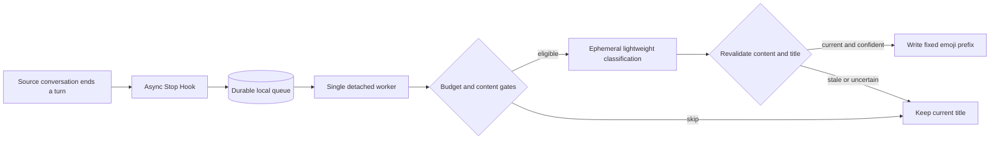

# Architecture

The source conversation is evidence for the classifier. It is never the classifier's execution context.

## Boundaries

`status_core.py` handles bounded inputs, credential-pattern redaction and conservative title decisions. `status_store.py` owns the durable queue, revision checks, usage reservations and a bounded diagnostic journal. `codex_rpc.py` connects to the official app-server transport. `status_worker.py` owns background lifecycle and classification. `semantic_status.py` provides management commands; `run-hook.sh` provides a quiet Python-version-aware entry point.

Original-thread calls are limited to reads and `thread/name/set`. The adapter uses `thread/turns/list` with a legacy full-read fallback and never resumes the source conversation. The first user goal and recent three turns are combined with a previously accepted summary. Full tool output is omitted.

Classification runs in an ephemeral thread with integrations, skills, tools and lifecycle Hooks disabled. Global AGENTS instructions can still be inherited by some runtimes; this is reflected in usage. Only a validated enum selects the title prefix. Model text never supplies the title itself.

## Work coordination

The queue stores one job per thread with a revision and due timestamp. Exact duplicate events are deduplicated. Later events extend the debounce window. A POSIX file lock permits one worker per data directory; a lifecycle lock closes the enqueue/worker-exit race.

Each inference reserves Tokens transactionally. Actual usage settles the reservation; failures preserve unknown usage or at least the larger observed usage. Call counters, per-thread cooldowns and budget totals survive process restarts. A budget preflight avoids even starting app-server when no request can be admitted.

Before writing, the worker rereads source content and title and checks the job revision. Changed content is deferred under the cooldown. Manual title changes pause the thread. There is no atomic compare-and-set title API, so the last read/write interval is a documented limit rather than a guaranteed transaction.

## Persistence and errors

Runtime data lives under the Codex data directory, separate from source and releases. Tables store queue jobs, deduplication keys, managed titles, semantic summaries, usage reservations and up to 200 diagnostic events. No new Codex database or rollout format is written directly.

The Hook prints only `{}` and exits successfully, even on malformed input or missing Python. Worker failures retain the current title and record a result code plus an error type. They do not add context, send messages or continue the original conversation.

## Compatibility

Python 3.11+ is required for standard-library TOML and timezone support. POSIX process groups and file locks constrain support to macOS/Linux. App-server methods and configuration can change; doctor verifies the executable and advertised model without inference. The adapter prefers a desktop-bundled runtime over an older PATH executable when available.
